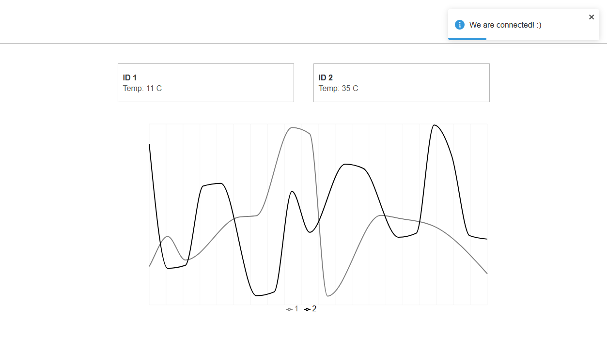

# Wiliot

A real time application that connects to a wabsocket server and presents data in a chart.

## Install

To install, clone this repository, access the root folder of the project and run the following scripts:

- npm install
- npm start

Also, you must clone [this](https://github.com/and-dzh3/ws-srv) repository and follow their instructions to run the backend.

## Available Scripts

| Script            | Description                                    |
| ----------------- | ---------------------------------------------- |
| npm start         | Runs the app in the development mode.          |
| npm test          | Runs unit tests                                |
| npm test:coverage | Runs unit tests and generate a coverage report |
| npm run build     | Builds the app for production                  |

## Requirements checked

- [x] The data should update every time new data is received from the socket
- [x] Add a Toast that indicates that the socket is connected or disconnected
- [x] Save 5 minutes data
- [x] If data value is bigger than 100, don't present it.
- [x] Add unit test or any automation testing if needed.

## Archtecture

 I am using the feature-first organization strategy that provides our app with isolation and encapsulation of UI components. This way our components are reusable in other projects. 😍

 Also, I aimed to reduce coupling and keep a low level of cognitive complexity.

### Folder Structure

| Folder     | Description                                             |
| ---------- | ------------------------------------------------------- |
| __assets   | Contains fonts and images.                              |
| adapters   | Contains adapters to external services.                 |
| api        | Contains API services like websock                      |
| components | Home for all React components                           |
| config     | Contains constants for configuration and global styling |
| core       | Contains pure functions with business logic.            |
| helpers    | Reusable functions that can be used anywere in the app  |
| hooks      | Custom React hooks                                      |
| model      | The entities' interfaces                                |
| pages      | Home for all the pages                                  |

